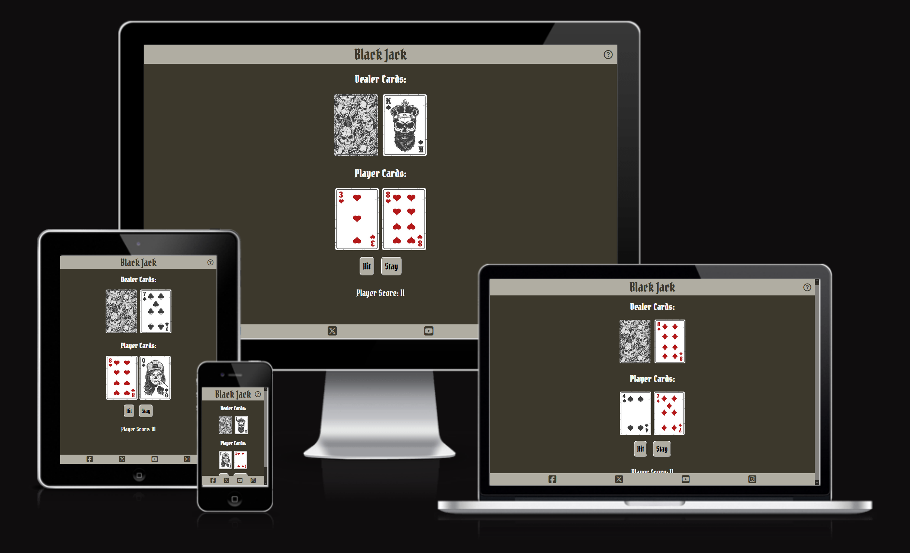
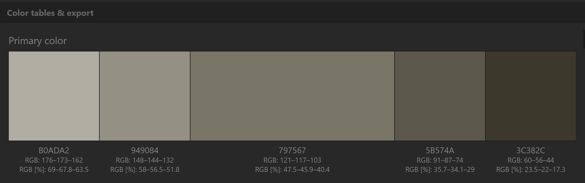

# BlackJack

[Visit the live website link](https://claudiosarto.github.io/blackjack/index.html)

 

## Features

### Existing Features

### Future Features left to Implement

## Design  

### UX Design  
A "mobile-first" approach has been used for design the site so initially for mobile devices, prioritizing functionality and user experience on smaller screens. Then using media query function to increase fonts and arrange the content for bigger screens. 

### Wireframes
Wireframes created for mobile, tablet and desktop.
- > placeholder Mobile <
- > placeholder Tablet <
- > placeholder Desktop <

### Color Scheme

Color scheme has been defined using [Paletton](https://paletton.com/) tool

- Header and footer background: `#B0ADA2`
- Header and footer font/icons color: `#3C382C`
- Main Content background color: `#3C382C` 
- Main Content font color: `#f5f5f5` 

## Technologies Used

### Languages Used
HTML, CSS, JavaScript

### Frameworks, Tools and Resources Used
- [Balsamiq](https://balsamiq.com/) - designing wireframes
- [Favicon](https://favicon.io/) - importing icons for footer and header
- [Microsoft Designer](https://designer.microsoft.com/) - generating images
- [Birme](https://www.birme.net/) - images resizing/compression
- [OpenAI ChatGPT](https://chat.openai.com/) - content generation
- [Quetext](https://www.quetext.com/) - antiplagiarism checking
- [Git](https://git-scm.com/) - code version control
- [Github](https://github.com/) - repository for al the site files
- [Gitpod](https://gitpod.io/) - IDE platform
- [Google Developer Tools](https://developer.chrome.com/docs/) - troubleshooting CSS styling
- [Am I Responsive](https://ui.dev/amiresponsive) - to generate a screenshot of different screen viewports 
- [W3C HTML Validation Service](https://validator.w3.org/) - to validate HTML code
- [W3C CSS Validation Service](https://jigsaw.w3.org/css-validator/) - to validate CSS code
- [JavaScript Validation Service](https://jshint.com/) - to validate JavaScript code
- [Markdown Table Generator](https://www.tablesgenerator.com/markdown_tables) - to generate tables in the testing.md file

## Deployment & Local Development

### Deployment
Site had been deployed using Github pages function.

I followed the Github istructions:
- Under your repository name, click Settings. If you cannot see the "Settings" tab, select the dropdown menu, then click Settings.
- In the "Code and automation" section of the sidebar, click Pages.
- Under "Build and deployment", under "Source", select Deploy from a branch.
- Under "Build and deployment", under "Branch", use the branch dropdown menu and select a publishing source.
-  Visit https://claudiosarto.github.io/blackjack/index.html to view your new website.  
Note that it can take up to 10 minutes for changes to your site to publish after you push the changes to GitHub.

### Local Development

#### How to Fork

To fork the repository:

1. Log in (or sign up) to Github.
2. Go to the repository for this project, [BlackJack](https://github.com/claudiosarto/blackjack)
3. Click the Fork button in the top right corner.

#### How to Clone

To clone the repository:

1. Log in (or sign up) to GitHub.
2. Go to the repository for this project, [BlackJack](https://github.com/claudiosarto/blackjack)
3. Click on the code button, select whether you would like to clone with HTTPS, SSH or GitHub CLI and copy the link shown.
4. Open the terminal in your code editor and change the current working directory to the location you want to use for the cloned directory.
5. Type 'git clone' into the terminal and then paste the link you copied in step 3. Press enter.

## Testing  

### Manual Testing 
Please refer to  page for the performed tests.

### Known Bugs
Following bug has been observed on Firefox browser in relation to JavaScript, but not present in Chrome and Edge:
<insert img here> 

### Content  

- Rules section has been generated with the help of [ChatGPT](https://chat.openai.com/). Content has been checked for antiplagiarism on using [Quetext](https://www.quetext.com/), report available at this [link](https://www.quetext.com/results/89e36fa13822ef58ab17) 
- Cards Image are from [Freepik](http://www.freepik.com) and Designed by brgfx / Freepik
- FavIcon has been generated using GenAI embedded in [Microsoft Designer](https://designer.microsoft.com/) - [T&C](https://designer.microsoft.com/termsOfUse.pdf) and converted using [Favicon] (https://favicon.io/)
- Icons from [Font Awesome](https://fontawesome.com/)
- Fonts from [Google Fonts](https://fonts.google.com/)
- [W3Schools](https://www.w3schools.com/) and [Stack Overflow](https://stackoverflow.com/) for some HTML/CSS features

### Credits

- Inspiration for the layout from the walthrough project "Love Math" from Code institute
- I used the following [Youtube tutorial by Kenny Yip Coding](https://www.youtube.com/watch?v=bMYCWccL-3U) to have an understanding of the logic and some code has been taken from there.

### Acknowledgments

I'd like to thank my mentor Jubril Akolade for giving me hints and tips during the project.