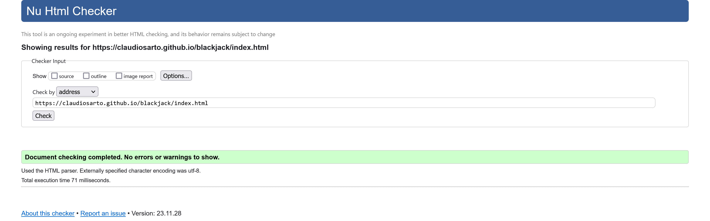
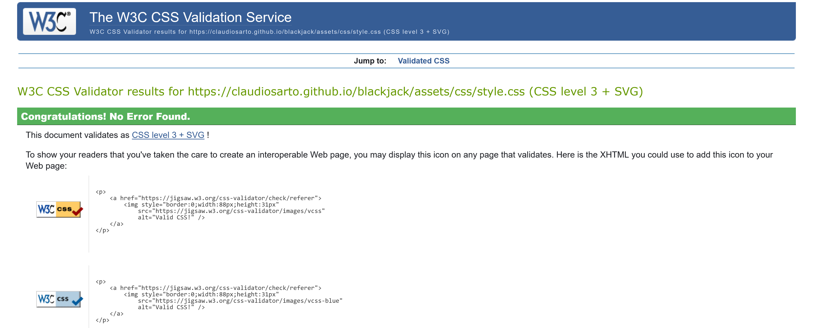
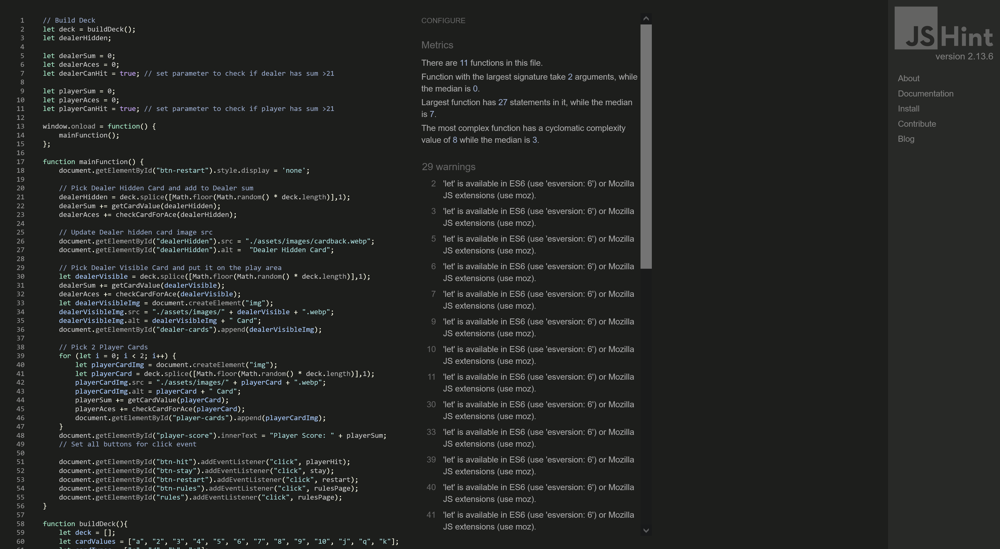
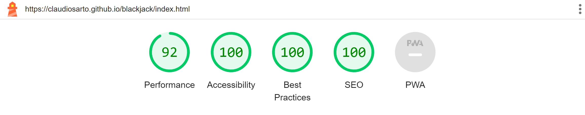
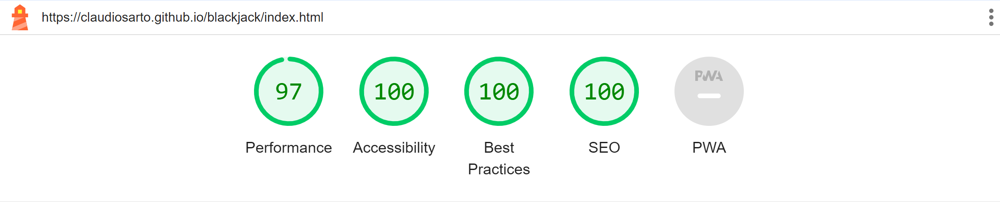

# BlackJack Testing

## Automated Tests

## HTML/CSS Validation

I used [W3C HTML](https://validator.w3.org/) validator to verfiy HTML compliance. No errors found.

Home Page:

I used [W3C CSS](https://jigsaw.w3.org/css-validator/) validator to verfiy CSS compliance. No errors found.
 

I used [JSHint](https://jshint.com/) validator to verfiy JavaScript compliance. No errors found. Only 29 warnings. 
 

### Lighthouse Performance

I used Lighthouse tool integrated in Chrome Developer to verify the performance, accessibility, best practices and SEO for all the website pages.

### Desktop Results

  

### Mobile Results

  

## Manual Tests

Testing performed on the following devices:
- Laptop:
    - Dell Latitude 15" screen

- Mobile devices:
    - Samsung A51
    - iPhone 14

- Browsers tested on each device:
    - Google Chrome
    - Firefox
    - Microsoft Edge (Laptop only)

#### Header
| Feature                         | Testing Performed                                       | Expected Result    | Result                                | Pass/Fail |
|---------------------------------|---------------------------------------------------------|--------------------|---------------------------------------|-----------|
| Show Rules                      | Click the ? icon                                        | Rules pop up       | Rules become visible                  | Pass      |
| Hide Rules                      | Click the ? icon when rules are visible                 | Rules disappear    | Rules disappear                       | Pass      |
| Hide Rules                      | Click anywhere in the rules area when rules are visible | Rules disappear    | Rules disappear                       | Pass      |
| Mouse Hover on ? Icon (Desktop) | Hover on ? icon                                         | Icons change color | Icon change color when hovering mouse | Pass      |
|                                 |                                                         |                    |                                       |           |

#### Game Area

| Feature              | Testing Performed                                          | Expected Outcome                                | Result                                                                                                                                                 | Pass/Fail |
|----------------------|------------------------------------------------------------|-------------------------------------------------|--------------------------------------------------------------------------------------------------------------------------------------------------------|-----------|
| Hit Button           | Click hit button                                           | Player gets a card                              | A new card is added to Player Cards area                                                                                                               | Pass      |
| Player Score Counter | After click the hit button player cards sum is calculated  | Correct player cards sum is updated             | Correct player cards sum is updated                                                                                                                    | Pass      |
| Stay Button          | Click stay button                                          | Game results are calculated and you get a popup | Hidden dealer card is revealed, dealer add additional cards to the hand to get at least 17,  results are calculated and a popup with win/loss shows up | Pass      |
| Results Area         | Click stay button                                          | After clicking stay, dealer score shows up      | Dealer sum shows after player score                                                                                                                    | Pass      |
| Restart Game Button  | After results pop up is visible, click restart game button | A new game begins                               | New game starts with new cards                                                                                                                         | Pass      |

#### Footer
| Feature    | Testing Performed                                       | Expected Result  | Result               | Pass/Fail |
|------------|---------------------------------------------------------|------------------|----------------------|-----------|
| Footer Social Media Links                           | Open related social media page  | Check every social media link opening in a new tab     | All links open respective social media site in a separate tab  | Pass |
| Footer Mouse Hover on Social Media Icons (Desktop)  | Icons change color              | Hover on every social media link opening in a new tab  | Each icon change color when hovering mouse                     | Pass |

